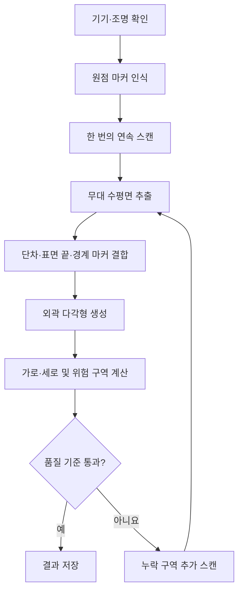
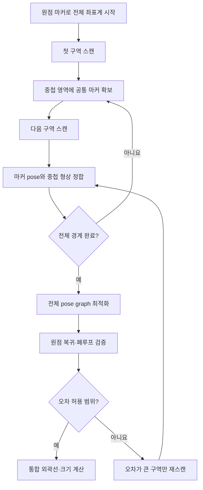

# StageVision 무대 평면 측정·인식 로직

## 1. 목적과 전제

이 문서는 LiDAR가 탑재된 iPhone Pro 또는 iPad Pro로 무대 평면을 측정하는 목표 로직을 정의한다.

- 사용자가 줄자나 레이저 거리 측정기로 무대 치수를 재지 않는다.
- 앱이 LiDAR, 카메라, IMU와 시각 마커를 이용해 미터 단위 좌표를 계산한다.
- 15m 이하 무대는 한 번의 연속 스캔을 기본으로 한다.
- 한 변이 15m를 넘는 무대는 겹치는 구역으로 나누어 스캔한 뒤 자동 정합한다.
- 측정 결과는 무대 외곽 다각형, 가로·세로, 위험 구역과 신뢰도로 제공한다.
- 자동 측정 결과를 낙상 방지 장치 자체로 간주하지 않는다. 앱은 인식 불확실성을 사용자에게 표시해야 한다.

> 현재 MVP는 RoomPlan이 감지한 가장 큰 바닥의 다각형 외곽과 1m 격자를 스캔 카메라 위에 실시간으로 표시한다. 스캔 적용 후의 2D 평면도는 아직 경계 상자 크기를 사용한다. 이 문서는 마커 인식, 비정형 2D 평면 저장, 구역 정합과 품질 검증을 포함한 다음 구현 단계의 설계안이다.

---

## 2. 공통 구성

### 2.1 입력 데이터

| 입력 | 역할 |
|---|---|
| LiDAR depth | 기기에서 표면까지의 거리 측정 |
| RGB 카메라 | 시각 특징과 마커 인식 |
| IMU·ARKit pose | 기기의 위치, 방향, 중력 방향 추정 |
| RoomPlan | 바닥·벽과 실내 구조 후보 생성 |
| ARKit scene mesh | 바닥 표면과 높이 단차를 더 세밀하게 분석 |
| 시각 마커 | 원점·방향 설정, 구역 간 동일 지점 식별, 위치 오차 검증 |

### 2.2 시각 마커

마커는 **인쇄된 고유 패턴을 얇은 무대용 테이프로 바닥에 고정한 것**이다. 단순 색 테이프 십자가는 사람에게는 잘 보이지만, 앱이 서로 다른 기준점을 구분하거나 회전 방향을 알아내기 어렵다.

권장 마커 구성:

- 각 마커마다 다른 고유 패턴과 ID를 사용한다. 예: `M01`, `M02`.
- 무대 앞에서 뒤를 가리키는 화살표를 인쇄한다.
- 앱에 마커의 실제 인쇄 크기를 등록한다.
- 무광 재질을 사용해 조명 반사를 줄인다.
- 모서리를 낮은 두께의 무대용 테이프로 완전히 고정한다.
- 초기 현장 시험 크기는 20~30cm로 하고, 실제 인식 거리와 조명에 따라 조정한다.

마커의 좌표를 사람이 측정해서 입력할 필요는 없다. 앱은 카메라와 LiDAR로 마커의 pose를 측정한다. 마커의 알려진 인쇄 크기는 거리·축척 검증에 사용한다.

### 2.3 좌표계

첫 번째 원점 마커를 기준으로 무대 좌표계를 만든다.

- 원점 마커 중심: `(0, 0)`
- 마커 화살표 방향: 무대 뒤쪽 `+Y`
- 화살표의 오른쪽: `+X`
- 중력 반대 방향: `+Z`

원점 마커가 무대 모서리에 정확히 있을 필요는 없다. 최종 무대 외곽선은 원점 마커를 기준으로 상대 좌표를 가지며, 앱은 외곽선의 최소 좌표를 기준으로 표시용 좌표를 다시 정규화한다.

### 2.4 무대 경계 판단 원칙

무대 끝은 다음 신호를 결합해 판단한다.

1. 동일한 높이에 연속적으로 존재하는 넓은 수평면을 무대 평면 후보로 찾는다.
2. 수평면의 LiDAR 점들을 무대 2D 좌표계에 투영한다.
3. 점이 충분히 관측된 영역을 점유 격자로 만든다.
4. 평면이 끝나면서 높이가 급격히 낮아지는 위치를 낙차 경계 후보로 삼는다.
5. 벽이나 수직 구조가 시작되는 위치도 외곽 후보로 기록한다.
6. 경계 마커가 있으면 자동 경계보다 마커 위치를 우선하는 보정점으로 사용한다.
7. 후보들을 연결해 무대 외곽 다각형을 만들고 작은 노이즈와 불필요한 굴곡을 제거한다.

바닥과 주변 바닥의 높이·재질이 완전히 같고 물리적인 단차도 없다면 센서만으로 공연 구역의 경계를 알아낼 수 없다. 이 경우 사용자가 무대 경계 위에 마커를 놓아 **경계의 의미만 지정**해야 한다. 길이를 직접 측정할 필요는 없다.

---

## 3. 한 변이 15m 이하인 무대

### 전체 흐름

### 단계 1. 스캔 준비

1. `RoomCaptureSession.isSupported`로 LiDAR 지원 여부를 확인한다.
2. 카메라 권한과 ARKit tracking 상태를 확인한다.
3. 조명이 부족하거나 기기 움직임이 너무 빠르면 스캔 시작을 막거나 안내한다.
4. 무대 위 이동 물체와 사람을 최소화한다.
5. 무대 경계를 자동 인식하기 어려운 환경이면 경계 모서리나 굴곡점에 마커를 둔다.

### 단계 2. 원점과 방향 설정

1. 사용자가 원점 마커를 무대 앞쪽의 접근 가능한 위치에 붙인다.
2. 앱이 마커 ID, 실제 크기, 중심 pose와 화살표 방향을 인식한다.
3. 마커 pose와 중력 방향으로 무대 좌표계를 생성한다.
4. 원점 마커가 안정적으로 여러 프레임에서 인식된 뒤 스캔을 시작한다.

### 단계 3. 단일 연속 스캔

1. 원점 마커에서 시작한다.
2. 무대 외곽을 따라 천천히 이동하면서 바닥과 가장자리를 비춘다.
3. 외곽을 한 바퀴 돈 뒤 내부를 지그재그로 이동해 빈 영역을 채운다.
4. 마지막에 원점 마커로 돌아와 시작 pose와 종료 pose의 차이를 계산한다.
5. 전체 과정에서 동일한 `ARSession`을 유지한다.

### 단계 4. 무대 평면 추출

1. RoomPlan의 `floors`를 바닥 후보로 가져온다.
2. ARKit scene mesh에서 바닥으로 분류된 면과 수평에 가까운 면을 추가한다.
3. 중력 방향과 거의 직각인 점들을 모아 지배적인 수평면을 추정한다.
4. 높이 편차가 큰 점, 이동하는 사람, 소품과 임시 장애물을 제외한다.
5. 여러 바닥 후보가 있으면 면적, 연속성, 원점 마커와의 높이 차이로 실제 무대를 선택한다.

### 단계 5. 외곽선 생성

1. 선택한 무대 평면의 점들을 2D 좌표로 투영한다.
2. 5~10cm 셀의 점유 격자를 만든다. 셀 크기는 성능과 현장 시험 결과에 따라 조정한다.
3. 관측 밀도가 낮은 작은 구멍은 주변 관측값으로 보완한다.
4. 높이 단차가 확인된 면은 높은 신뢰도의 경계로 표시한다.
5. 단순히 카메라가 보지 못해 데이터가 없는 부분은 경계로 확정하지 않는다.
6. 경계 마커의 위치를 외곽 다각형의 꼭짓점 또는 변 위 제약조건으로 추가한다.
7. 외곽선을 단순화하되 실제 돌출부나 오목한 영역은 유지한다.

### 단계 6. 무대 크기 계산

직사각형에 가까운 무대:

1. 외곽 다각형을 포함하는 최소 회전 직사각형을 계산한다.
2. 긴 변과 짧은 변을 각각 가로·세로 후보로 제공한다.
3. 원점 마커의 화살표 방향으로 무대 앞·뒤를 확정한다.

비정형 무대:

1. 외곽 다각형 자체를 기본 데이터로 저장한다.
2. 전체 최대 폭과 최대 깊이를 보조 치수로 계산한다.
3. 안전 영역은 직사각형이 아니라 외곽 다각형을 안쪽으로 offset해서 생성한다.

### 단계 7. 품질 검증

다음 항목으로 품질 점수를 계산한다.

- 바닥 표면 관측 비율
- 외곽 경계 관측 비율
- 원점 복귀 후 위치·각도 오차
- 마커별 반복 인식 위치 편차
- RoomPlan 바닥과 ARKit mesh 경계 간 차이
- 서로 다른 시간에 관측한 동일 구역의 높이 편차

초기 제품 검증용 기준 예시:

| 상태 | 조건 예시 | 처리 |
|---|---|---|
| 높음 | 경계 대부분 관측, 원점 복귀 오차 5cm 이하 | 결과 사용 |
| 보통 | 일부 경계 누락 또는 오차 5~10cm | 불확실 영역 표시 후 추가 스캔 권장 |
| 낮음 | 오차 10cm 초과, 추적 중단, 넓은 경계 누락 | 결과 확정 금지 및 재스캔 |

이 수치는 초기 제안값이며 실제 무대 데이터로 조정해야 한다.

### 단계 8. 위험 구역 계산

1. 사용자가 위험 구역을 적용할 가장자리를 앞·좌·우·뒤에서 각각 선택한다.
2. 사용자가 기본 위험 폭을 1.0m 또는 1.5m로 선택한다.
3. 선택한 변만 무대 안쪽으로 선택한 폭만큼 offset한다.
4. 외곽과 offset 경계 사이를 기본 위험 구역으로 표시한다.
5. 측정 불확실성이 `e`미터라면 선택 폭에 `e`를 더해 확장한다.
6. 경계가 확인되지 않은 부분은 별도의 미확인 위험 영역으로 표시한다.

---

## 4. 한 변이 15m를 초과하는 무대

15m를 넘는 공간은 한 번의 RoomPlan 결과에 의존하지 않는다. 앱이 무대를 여러 구역으로 나누고, 인접 구역의 공통 마커와 중첩된 LiDAR 형상을 이용해 하나의 좌표계로 합친다.

### 전체 흐름

### 단계 1. 동적 구역 생성

전체 무대 크기를 미리 모르므로 앱이 이동 경로와 누적 지도를 기준으로 구역을 생성한다.

1. 첫 구역의 목표 범위를 약 8m × 8m로 설정한다.
2. 사용자가 이동하면 앱이 현재 pose로 원점부터의 거리를 계산한다.
3. 현재 구역의 안정적인 관측 범위를 벗어나기 전에 다음 구역을 만든다.
4. 인접 구역은 최소 2m 또는 폭의 25~35%가 겹치도록 안내한다.
5. 화면에 현재 구역, 다음 이동 방향과 아직 관측되지 않은 영역을 표시한다.

이 과정의 거리는 ARKit과 LiDAR가 계산하므로 사용자가 길이를 잴 필요가 없다.

### 단계 2. 공통 마커 배치

1. 앱이 다음 구역으로 넘어가기 전에 마커 배치 시점을 안내한다.
2. 사용자는 안내된 중첩 영역에 고유 마커를 바닥 테이프로 고정한다.
3. 인접한 두 구역에서 최소 2개, 가능하면 3개의 동일 마커가 보이도록 한다.
4. 마커들이 한 직선에만 놓이지 않도록 서로 다른 위치에 분산한다.
5. 앱은 각 마커를 여러 각도에서 인식하고 pose 분산이 충분히 작아질 때까지 대기한다.

마커는 구역의 실제 좌표를 사람이 입력하는 도구가 아니다. 두 스캔에서 `이 위치가 동일한 실제 지점`임을 앱에 알려주는 도구다.

### 단계 3. 구역별 스캔

각 구역에서 다음 순서를 반복한다.

1. 이전 구역과 공유하는 마커를 먼저 인식한다.
2. 중첩 영역을 충분히 스캔해 공통 바닥 형상을 확보한다.
3. 새 구역의 외곽과 내부를 스캔한다.
4. 다음 구역과 공유할 마커를 인식한다.
5. 구역의 바닥 점유 격자, 경계 후보, 마커 pose와 신뢰도를 저장한다.
6. `RoomCaptureSession.stop(pauseARSession: false)` 방식으로 ARSession을 유지한다.

Apple은 여러 RoomPlan 스캔을 합칠 때 연속된 ARSession 또는 `ARWorldMap`으로 재위치된 공통 좌표계를 사용하도록 안내한다.

### 단계 4. 세션 중단 대응

앱이 백그라운드로 이동하거나 tracking이 끊긴 경우:

1. 마지막 안정 상태의 `ARWorldMap`과 마커 상태를 저장한다.
2. 사용자에게 마지막 공통 마커 주변으로 돌아가도록 안내한다.
3. ARKit relocalization이 완료될 때까지 스캔 데이터를 확정하지 않는다.
4. 월드맵 복구 후 공통 마커 pose를 다시 비교한다.
5. pose 차이가 기준을 넘으면 해당 구역을 새로운 세션으로 기록하고 마커 기반 정합을 수행한다.

### 단계 5. 구역 좌표 정합

연속 ARSession이 정상인 경우에도 누적 drift를 보정하기 위해 마커 정합을 수행한다.

1. 구역 A와 B에서 관측한 동일 마커 pose를 매칭한다.
2. 공통 마커들의 중심과 방향이 가장 잘 겹치는 회전·이동 변환을 계산한다.
3. LiDAR와 알려진 마커 크기로 축척 차이가 없는지 검사한다.
4. 공통 바닥 mesh 또는 점군을 이용해 변환을 미세 조정한다.
5. 특정 마커 하나의 오차가 크면 이상치로 제외하되 사용자에게 표시한다.
6. 정합 후 공통 마커의 잔차와 중첩 표면 간 거리를 품질값으로 저장한다.

마커 하나의 pose만으로도 변환을 계산할 수 있지만, 검출 오차를 확인할 수 없으므로 최소 2개 이상을 사용한다.

### 단계 6. 전체 pose graph 최적화

구역을 순서대로 붙이기만 하면 작은 오차가 끝부분에 누적된다. 이를 줄이기 위해 전체 관계를 동시에 최적화한다.

1. 각 구역을 graph의 node로 만든다.
2. 공통 마커와 중첩 표면의 상대 pose를 edge로 만든다.
3. 원점 구역은 고정한다.
4. 모든 마커 잔차와 표면 잔차의 합이 최소가 되도록 각 구역 pose를 조정한다.
5. 신뢰도가 낮은 관측에는 작은 가중치를 적용한다.
6. 마지막 구역에서 원점 마커를 다시 관측해 폐루프 제약을 추가한다.

### 단계 7. 통합 외곽선 생성

1. 정합된 모든 구역의 점유 격자를 전체 좌표계로 변환한다.
2. 중첩 셀은 관측 횟수와 센서 거리 기반 신뢰도로 합성한다.
3. 높이 단차, 표면 끝과 경계 마커를 결합한다.
4. 단순히 어느 구역에서도 관측되지 않은 영역은 외곽으로 확정하지 않는다.
5. 통합 외곽 다각형을 생성하고 구역 접합부의 작은 틈을 제거한다.
6. 최소 회전 직사각형 또는 비정형 다각형 방식으로 전체 치수를 계산한다.

### 단계 8. 대형 무대 품질 검증

구역별·전체 품질을 모두 검사한다.

- 각 인접 구역의 공통 마커 잔차
- 중첩된 LiDAR 표면 사이의 거리
- 구역별 바닥 높이 차이
- 원점 복귀 폐루프 오차
- 전체 경계의 관측 비율
- 구역을 연결할수록 오차가 한쪽 방향으로 증가하는지 여부

오차가 기준을 넘으면 전체를 다시 스캔하지 않고 문제가 있는 구역과 양쪽 중첩 영역만 다시 스캔한다.

### 단계 9. 대형 무대 위험 구역

1. 사용자가 앞·좌·우·뒤 중 위험 구역을 적용할 가장자리와 1.0m·1.5m 중 기본 폭을 선택한다.
2. 선택한 변을 기준으로 통합 외곽 다각형의 위험 구역을 계산한다.
3. 전체 정합 잔차 중 보수적인 값을 위치 불확실성 `e`로 사용한다.
4. 선택한 기본 폭에 `e`를 더해 위험 구역을 확장한다.
5. 구역 접합부, 미관측 경계와 신뢰도가 낮은 부분은 별도 색상으로 표시한다.
6. 앱은 `측정 완료`, `추가 스캔 필요`, `경계 확인 불가` 상태를 명확히 구분한다.

---

## 5. 15m 이하·초과 로직 비교

| 항목 | 15m 이하 | 15m 초과 |
|---|---|---|
| 기본 방식 | 단일 연속 스캔 | 겹치는 다중 구역 스캔 |
| 권장 구역 크기 | 전체를 한 구역으로 처리 | 구역당 약 8~9m |
| 좌표계 | 원점 마커 + 단일 ARSession | 원점 마커 + 공통 마커 + pose graph |
| 마커 | 원점 및 필요한 경계점 | 원점, 경계점, 구역별 공통 마커 |
| 정합 | 원점 복귀 오차 확인 | 마커 정합 + 중첩 mesh 정합 + 폐루프 |
| 세션 중단 | 해당 스캔 재개 또는 재스캔 | ARWorldMap relocalization 후 계속 진행 |
| 실패 복구 | 누락된 부분 추가 스캔 | 오차가 큰 구역만 선택 재스캔 |
| 주요 위험 | 열린 무대 경계 오인식 | 위치 drift 누적과 구역 접합 오차 |

---

## 6. 권장 구현 순서

### 1단계: 15m 이하 단일 스캔

- RoomPlan 바닥의 `polygonCorners`, `dimensions`, `transform` 저장
- 원점·경계 이미지 마커 인식
- ARKit mesh 기반 높이 단차 탐지
- 외곽 다각형과 신뢰도 생성
- 실제 무대에서 반복 오차 측정

### 2단계: 연속 ARSession 기반 다중 구역

- 구역 생성과 스캔 진행 UI
- `pauseARSession: false`를 사용한 세션 유지
- 공통 마커 자동 매칭
- 구역별 점유 격자와 경계 저장
- 두 구역의 회전·이동 정합

### 3단계: 대형 무대 전체 최적화

- `ARWorldMap` 저장과 relocalization
- 다중 구역 pose graph 최적화
- 폐루프 검증
- 오차가 큰 구역 자동 식별 및 부분 재스캔
- 전체 불확실성을 반영한 위험 구역 생성

---

## 7. 제한 사항

- RoomPlan은 일반적인 실내 공간을 대상으로 설계되어 열린 무대의 끝을 항상 경계로 인식하지 않는다.
- 검은색, 반사 재질, 투명 재질, 강한 무대 조명은 깊이와 카메라 특징 인식을 방해할 수 있다.
- 바닥과 주변 영역 사이에 물리적·시각적 차이가 없으면 앱은 공연 구역의 의미를 자동으로 알 수 없다. 이때는 경계 마커가 필요하다.
- 마커가 가려지거나 이동하면 구역 정합의 기준이 훼손된다.
- ARKit tracking이 정상이어도 이동 거리가 길어지면 drift가 누적될 수 있으므로 공통 마커와 폐루프 검증을 생략하지 않는다.
- 표시 단위가 0.1m라고 해서 측정 정확도가 0.1m로 보장되는 것은 아니다.

---

## 8. 참고 자료

- [Apple RoomPlan](https://developer.apple.com/documentation/roomplan)
- [Apple: Scanning the rooms of a single structure](https://developer.apple.com/documentation/roomplan/scanning-the-rooms-of-a-single-structure)
- [Apple ARImageAnchor](https://developer.apple.com/documentation/arkit/arimageanchor)
- [Apple ARWorldMap](https://developer.apple.com/documentation/arkit/arworldmap)
- [Apple ARKit Scene Reconstruction](https://developer.apple.com/documentation/arkit/arworldtrackingconfiguration/scenereconstruction)
- [Apple Machine Learning Research: RoomPlan](https://machinelearning.apple.com/research/roomplan)
